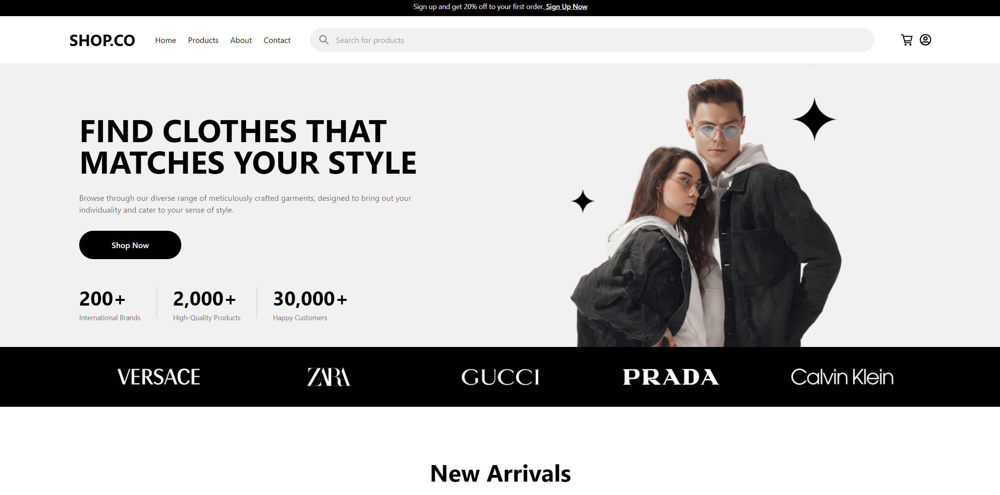
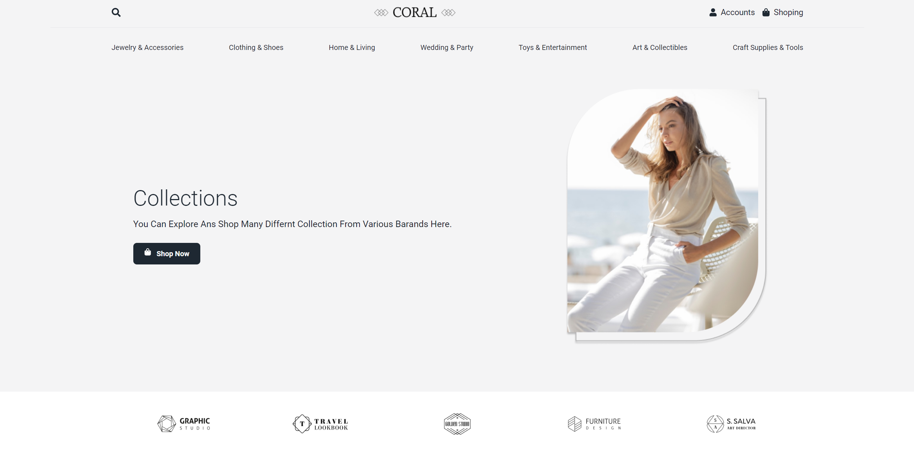
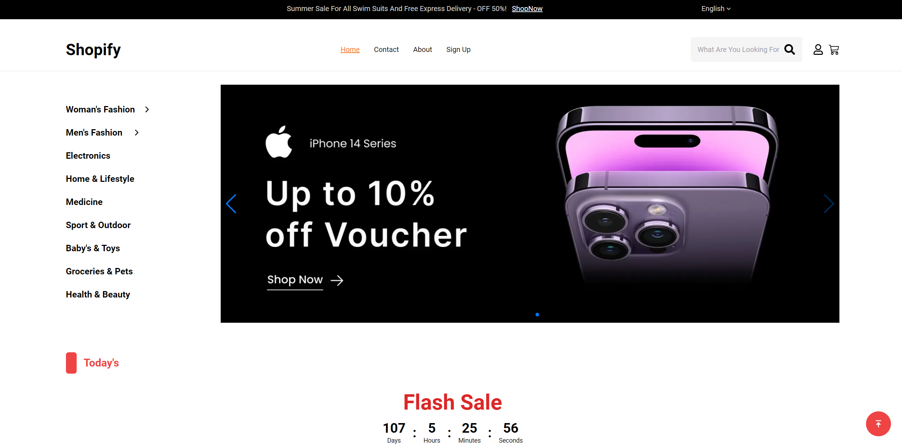

# E-Commerce Projects 🛒

Welcome to the **E-Commerce Projects** repository! 🎉 This repository serves as a catalog for various e-commerce websites I've developed. Below you'll find live previews, links to the repositories, and image previews of each project.

## Overview 📚

This repository showcases a collection of my e-commerce projects, demonstrating different aspects of online store development. Each project has its own repository with code, and you can also view live demos.

## Projects 🚀

### [Modern Shop](https://ahmedkamal14.github.io/eShop/) 🛍️
A modern e-commerce site built with React and Tailwind CSS. Features include a responsive design, product catalog, shopping cart, and secure checkout.

- **[Live Preview](https://ahmedkamal14.github.io/eShop/)**
- **[Repository](https://github.com/ahmedkamal14/eShop)**

---

### [Fashion Hub](https://ahmedkamal14.github.io/E-Commerce-Website/) 👗
An elegant online fashion store built using Vite and React. Includes advanced filtering options, user authentication, and a sleek UI.

- **[Live Preview](https://ahmedkamal14.github.io/E-Commerce-Website/)**
- **[Repository](https://github.com/ahmedkamal14/E-Commerce-Website)**

---

### [Tech Store](https://ahmedkamal14.github.io/E-Commerce-Website-2/) 💻
A tech-focused e-commerce platform with a clean design. Features comprehensive product listings and integrates with a payment gateway for secure transactions.

- **[Live Preview](https://ahmedkamal14.github.io/E-Commerce-Website-2/)**
- **[Repository](https://github.com/ahmedkamal14/E-Commerce-Website-2)**

---

## Features 🌟

- **Responsive Design**: Fully responsive for a great user experience across devices. 📱💻
- **Modern Technologies**: Built with React, Tailwind CSS, Vite, and more. ⚛️
- **User Authentication**: Secure login and registration for personalized shopping. 🔐

## Getting Started 🏁

To explore any of the projects, click on the **Live Preview** links to view them in action, or check out the **Repository** links to dive into the code.

## License 📜

This project is licensed under the [MIT License](https://opensource.org/licenses/MIT). See the [LICENSE](LICENSE) file for details.

