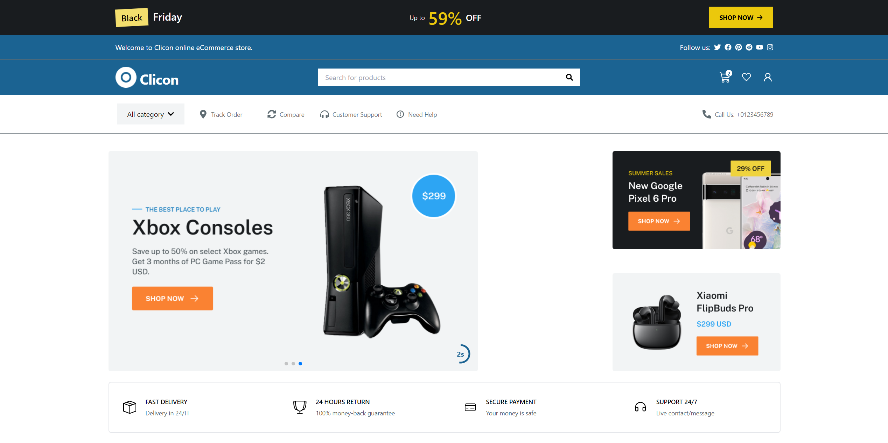

# E-Commerce Projects 🛒

Welcome to the **E-Commerce Projects** repository! 🎉 This repository serves as a catalog for various e-commerce websites I've developed. Below you'll find live previews, links to the repositories, and image previews of each project.

## Overview 📚

This repository showcases a collection of my e-commerce projects, demonstrating different aspects of online store development. Each project is built with modern technologies, API integrations, and demonstrates real-world e-commerce features. You can explore the live demos and check out the code in the repositories.

## Projects 🚀

### [Modern Shop](https://ahmedkamal14.github.io/eShop/) 🛍️
A modern e-commerce site built with **React** and **Tailwind CSS**. It features responsive design, product catalog, shopping cart, and secure checkout. The website fetches real-time product data using APIs.

- **[Live Preview](https://ahmedkamal14.github.io/eShop/)**
- **[Repository](https://github.com/ahmedkamal14/eShop)**

---

### [Fashion Hub](https://ahmedkamal14.github.io/E-Commerce-Website/) 👗
An elegant online fashion store built using **Vite** and **React**. It includes advanced filtering options, user authentication, and a sleek UI. The data for the products and filters is fetched from APIs to provide dynamic content.

- **[Live Preview](https://ahmedkamal14.github.io/E-Commerce-Website/)**
- **[Repository](https://github.com/ahmedkamal14/E-Commerce-Website)**

---

### [Tech Store](https://ahmedkamal14.github.io/E-Commerce-Website-2/) 💻
A tech-focused e-commerce platform with a clean design, built using **React** and **Vite**. This site fetches data via APIs, supports product search, and integrates a payment gateway for secure transactions.

- **[Live Preview](https://ahmedkamal14.github.io/E-Commerce-Website-2/)**
- **[Repository](https://github.com/ahmedkamal14/E-Commerce-Website-2)**

---

### [MindSetGradProject](https://ahmedkamal14.github.io/MindSetGradProject/) 🧠
A modern e-commerce website designed to sell various products. It integrates dynamic product listings, advanced filtering, and a smooth shopping cart experience. The project also ensures responsiveness across all devices.

- **[Live Preview](https://ahmedkamal14.github.io/MindSetGradProject/)**
- **[Repository](https://github.com/ahmedkamal14/MindSetGradProject)**

---

## Features 🌟

- **Responsive Design**: Fully responsive for a seamless user experience across devices. 📱💻
- **APIs & Data Fetching**: Integrated with external APIs to fetch dynamic data for product listings and categories. 🌐
- **Secure Payments**: Integration with payment gateways for smooth and secure transactions. 💳
- **Modern Technologies**: Built using the latest technologies like **React**, **Vite**, and **Tailwind CSS**. ⚛️
- **User Authentication**: Secure login and registration using **JS-Cookies**. 🔐
- **Toast Notifications**: Uses **React Toastify** for interactive user notifications.
- **Swiper Integration**: Uses **React Swiper** for product carousels and sliders.
- **Loading Indicators**: Implements **React Spinner** for smooth user experience during loading states.

## Technologies Used 💻

Here’s a list of the technologies used across these projects:

- **Vite** 
- **React** 
- **Tailwind CSS** 
- **JavaScript** 

## Libraries & Tools 🛠️

For development, I used several React hooks and libraries to enhance the functionality and maintainability of the codebase:

- **React Router DOM** 
- **React Icons** 
- **JS Cookies** 
- **React Toastify** 
- **React Swiper** 
- **React Spinner** 
- **Redux Toolkit** 
- **Axios** 
- **React Use** 
- **useLocalStorage** for managing cart state in local storage.

## Getting Started 🏁

To explore any of the projects, click on the **Live Preview** links to see them in action, or visit the **Repository** links to view the code.

## License 📜

This project is licensed under the [MIT License](https://opensource.org/licenses/MIT). See the [LICENSE](LICENSE) file for details.
